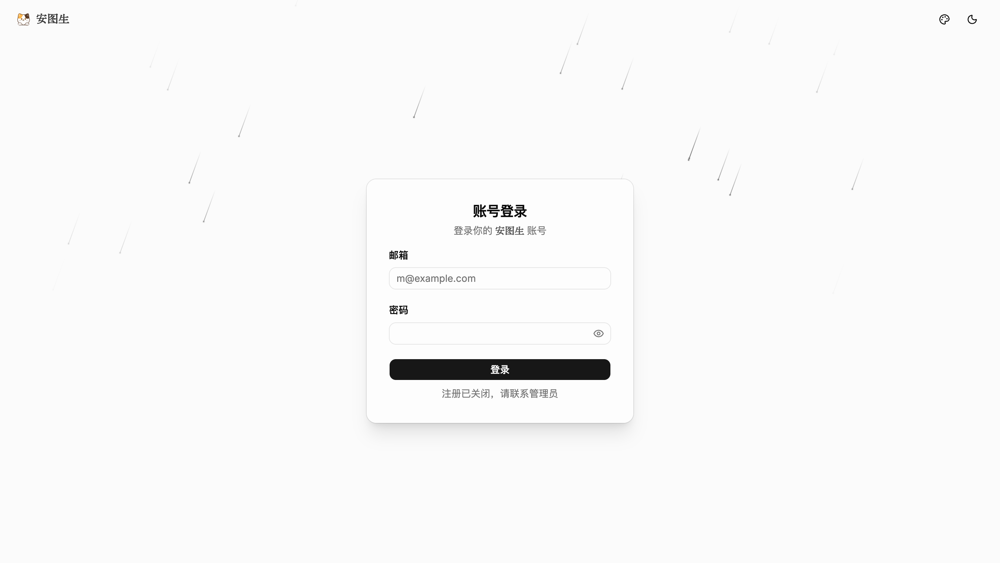
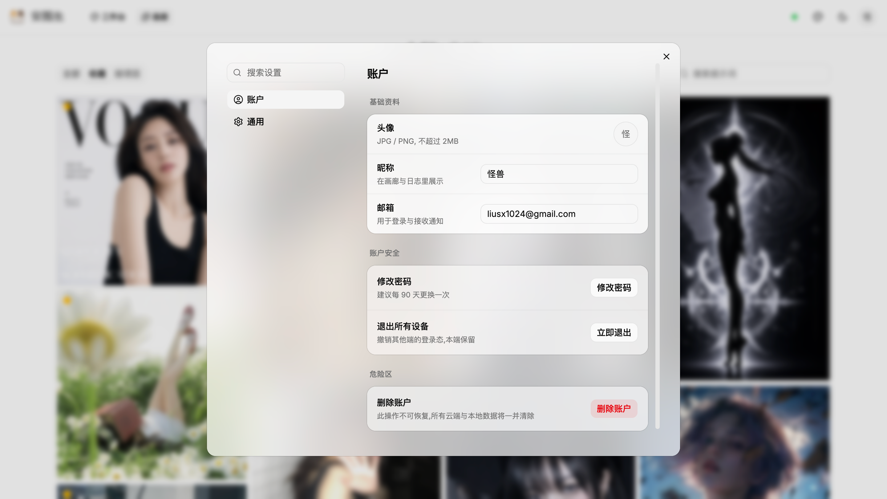
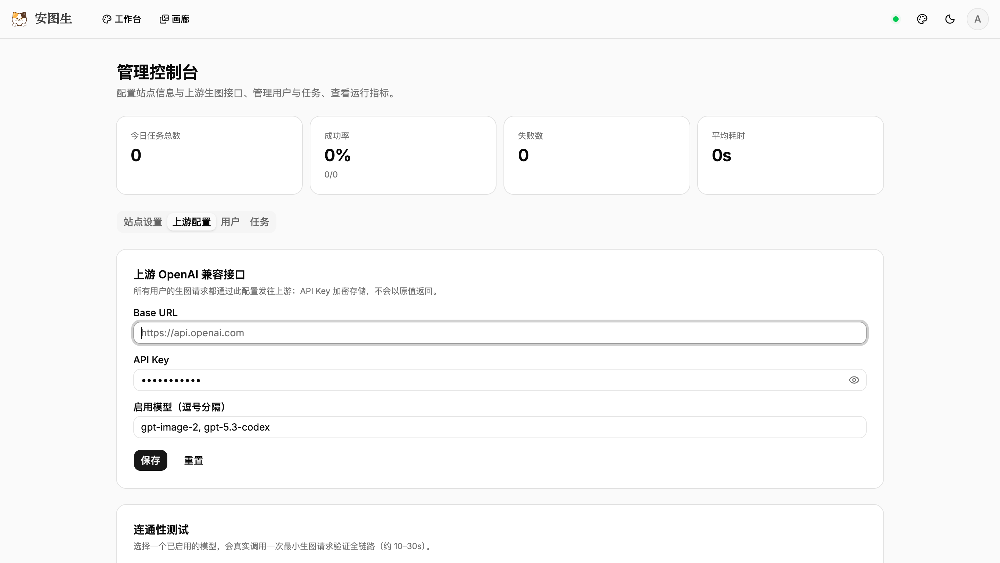
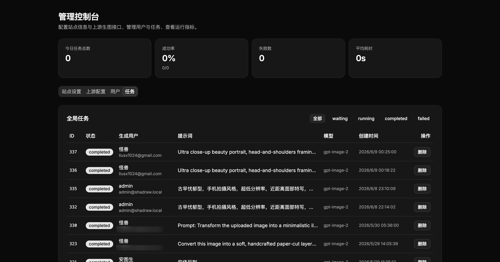

# shadraw-studio

面向设计师、内容创作者和 AI 图片爱好者的在线 AI 生图工作台。项目提供提示词编排、模型参数控制、图片社区、历史记录、收藏管理、系统设置和管理后台，前后端在同一仓库内统一开发与发布。

## 功能概览

- **AI 生图控制台**: 支持提示词、模型、风格、尺寸比例、生成数量等参数配置，并展示上游错误详情。
- **图片社区与记录管理**: 支持浏览生成作品、收藏图片、分页加载和主题化展示。
- **账户与权限**: 提供登录注册、JWT 鉴权、用户会话和后台管理入口。
- **系统设置**: 支持界面主题切换、账号信息和偏好设置。
- **一体化部署**: 前端构建产物嵌入 Go 二进制，生产环境以单进程、单端口方式运行。

## 界面截图

<table>
  <tr>
    <td><strong>登录</strong><br></td>
    <td><strong>设置</strong><br></td>
  </tr>
  <tr>
    <td><strong>控制台 - 浅色</strong><br></td>
    <td><strong>控制台 - 深色</strong><br></td>
  </tr>
  <tr>
    <td><strong>社区 - 浅色</strong><br></td>
    <td><strong>社区 - 深色</strong><br></td>
  </tr>
  <tr>
    <td><strong>管理后台 - 浅色</strong><br></td>
    <td><strong>管理后台 - 深色</strong><br></td>
  </tr>
</table>

## 技术栈

- 后端: Go 1.26 · Gin · PostgreSQL · MinIO (S3 兼容对象存储) · JWT 鉴权
- 前端: Vite · React 19 · React Router v7 · TypeScript · Tailwind CSS v4 · shadcn/ui · Radix UI · Motion · Lucide React
- 部署: 本地交叉编译 Go 二进制 · systemd · Docker Compose 依赖服务 · nginx 反代

## 目录结构

```text
shadraw-studio/
├── cmd/                Go 入口，包含 cmd/server 主服务和迁移工具
├── internal/           Go 业务包，包含 auth / record / blob / web embed 等模块
├── migrations/         SQL 迁移
├── web/                Vite + React 19 + React Router SPA
├── docs/               后端 API / DB / 部署迁移文档与截图
├── deploy/             binary + systemd 生产部署脚本与文档
├── go.mod              Go module 根
├── Dockerfile          容器镜像构建文件
└── docker-compose.yml  本地依赖 stack
```

## 快速开始

### 1. 准备依赖服务

```bash
docker compose up -d db minio
```

### 2. 启动后端 API

```bash
cp .env.example .env
go run ./cmd/server
```

后端默认监听 `:8088`。本地开发会自动加载仓库根目录 `.env`；生产环境请设置 `APP_ENV=production`，并由 systemd 或 Docker 显式注入环境变量。

### 3. 启动前端 dev server

```bash
cd web
npm install
npm run dev
```

打开 `http://localhost:3001`。开发模式下 `/api/*` 请求由 Vite proxy 转发到 `http://localhost:8088`，无需额外配置 CORS 或前端 API 基址。

## 常用命令

| 目录 | 命令 | 说明 |
| --- | --- | --- |
| 根目录 | `go run ./cmd/server` | 启动 API server |
| 根目录 | `go build ./cmd/server` | 编译服务端，包含嵌入式前端资源 |
| 根目录 | `make test` | 运行 Go 单测，包含 race 和 cover |
| 根目录 | `make lint` | 运行 `golangci-lint run` |
| `web/` | `npm run dev` | 启动 Vite dev server |
| `web/` | `npm run build` | 产出 `web/dist/` |
| `web/` | `npm run typecheck` | 运行 `tsc --noEmit` |
| `web/` | `npm run lint` | 运行 ESLint |

## 生产部署

生产环境采用 binary + systemd 模式：本地执行 `vite build` 后将前端产物嵌入 Go 二进制，再交叉编译 linux/amd64，通过 `deploy/deploy-binary.sh` 推送到 VPS。VPS 使用 Docker Compose 运行 Postgres 和 MinIO，API 由 systemd 管理并监听 `127.0.0.1:8088`，宿主 nginx 通过单个 upstream 反代即可。

详细步骤、环境变量和 nginx 模板见 [deploy/README.md](deploy/README.md)。

## 架构亮点

- **单进程 / 单端口**: 前端 `vite build` 产物拷入 `internal/web/dist/`，Go 通过 `//go:embed` 把 SPA 嵌入二进制。线上服务同时响应 `/api/v1/*` 业务接口、静态资源和 SPA 路由 fallback。
- **nginx 单 upstream**: 宿主反代只需要一条 `proxy_pass http://127.0.0.1:8088;`，无需拆分前端和后端 location。
- **同源 API 调用**: 前端使用相对路径调用 API，减少 CORS、环境变量和部署差异带来的配置复杂度。
- **扁平 monorepo**: Go module 在仓库根目录，前端在 `web/`，生产发布物是单个 Go 二进制。
